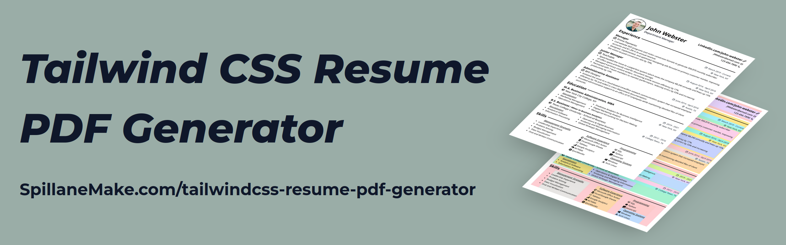

*A pdf generator tool using Tailwindcss, Next.js, and Puppeteer to design resume layouts on standard A4 page.*

## Overview
- Create a new page inside a `<Page/>` component and place it inside the `<PageBreakSpacing/>` tags in the main region of the index home page.
- Create multi-page documents by adding more pages to the resume pdf workspace.
- Page breaks can be removed from the home page by removing the `<PageBreakSpacing/>` wrapper.
- The templates directory contains components used to create the demo resume.
- Resume data is stored in the `data` folder as javscript objects.
- The shape of the javascript object accepted by each template is included as a type interface.
- Elements marked with the `id='layout'` will have a background color applied when the background layouts toggle is active.
- Element background layout colors will not be included in the downloaded pdf.
- Icons are imported from the packages: [@heroicons](https://heroicons.com/) and [react-icons](https://react-icons.github.io/react-icons/)
- Start the start Next.js in development mode using the `dev` command to begin designing a new page.


## Usage

1. Clone the repository from GitHub.
```Bash
git clone https://github.com/SpillaneMakes/tailwindcss-resume-pdf-generator.git
```

2. Make sure you have a Node package manager installed (e.g. NPM or Yarn).
```Bash
npm --version
# or
yarn --version
```

3. Navigate to the project directory and start the Next.js project in development mode.
```Bash
cd /Downloads/tailwindcss-resume-pdf-generator

npm run dev
# or
yarn dev
```

4. Open a browser to [localhost:3000](localhost:3000).
<p align="center">
  
</p>

5. Replace the demo page with a new page ( or pages ) in `src/pages/index.tsx`
```tsx
...
	{/* Resume PDF Workspace */}
	<main className='flex flex-col items-center'>
		<PageBreakSpacing>
			<ExampleResumeLayout />
			{/* Place new pages here */}
		</PageBreakSpacing>
	</main>
...
```

